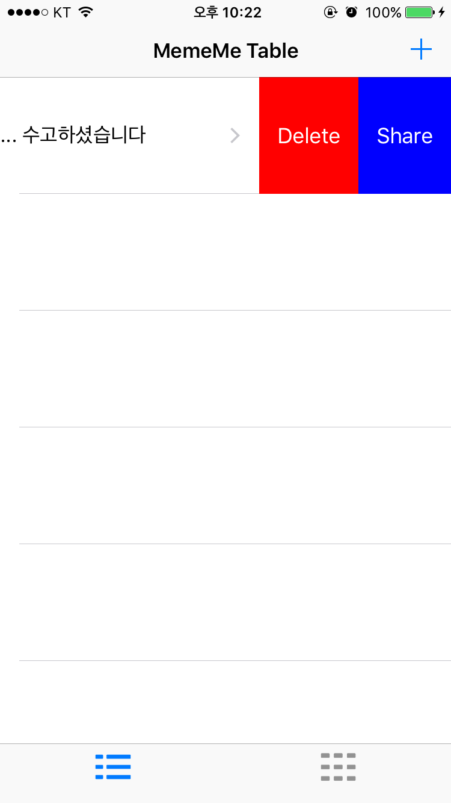

# MemeMe
[Udacity - UIKit Fundamentals](https://classroom.udacity.com/courses/ud788)강의를 기반으로 제작된 앱입니다.

## 기능

udacity 강의 기본 기능 구현

- 앨범, 카메라로 부터 이미지 가져오기
- Meme 이미지 저장 및 공유
- Table View 와 Collection View를 통해 Meme 리스트 조회

## Kick

- Table View Cell을 Swipe기능을 사용해 Meme를 공유하거나 삭제

## 영상

